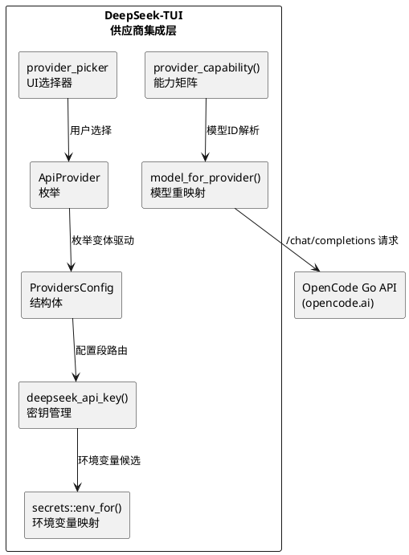
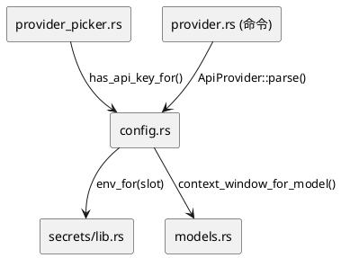

# **1. 实现模型**

## **1.1 上下文视图**

本组件在DeepSeek-TUI的现有供应商架构中新增OpenCode Go供应商，遵循exhaustive match模式。核心变更集中在`ApiProvider`枚举及其所有派生match分支，涉及5个源文件和1个测试文件。



## **1.2 服务/组件总体架构**

### 架构分层

| 层级 | 组件 | 职责 |
|---|---|---|
| **枚举层** | `ApiProvider::OpencodeGo` | 供应商标识与序列化 |
| **配置层** | `ProvidersConfig.opencode_go` | TOML配置段解析与合并 |
| **密钥层** | `deepseek_api_key()` + `secrets::env_for()` | API Key三级优先级解析 |
| **模型层** | `model_for_provider()` + `normalize_model_name()` | 模型ID前缀去除与规范化 |
| **能力层** | `provider_capability()` | 14个模型的能力矩阵查询 |
| **UI层** | `provider_picker::env_var_for()` | 供应商选择器集成 |

### 依赖关系



## **1.3 实现设计文档**

### 1.3.1 crates/tui/src/config.rs

#### A. 新增常量

在现有供应商常量块后添加：

```rust
pub const DEFAULT_OPENCODE_GO_MODEL: &str = "deepseek-v4-pro";
pub const DEFAULT_OPENCODE_GO_BASE_URL: &str = "https://opencode.ai/zen/go/v1";
```

**设计依据**：与现有`DEFAULT_NVIDIA_NIM_MODEL`/`DEFAULT_NVIDIA_NIM_BASE_URL`等常量保持一致的命名和布局模式。默认模型选择`deepseek-v4-pro`因其为V4系列中能力最强的thinking模型。

#### B. ApiProvider枚举变体

```rust
pub enum ApiProvider {
    Deepseek,
    DeepseekCN,
    NvidiaNim,
    Openrouter,
    Novita,
    Fireworks,
    Sglang,
    Vllm,
    OpencodeGo,  // 新增
}
```

`#[serde(rename_all = "snake_case")]`自动将`OpencodeGo`序列化为`"opencode_go"`，与TOML键名`providers.opencode_go`一致。

#### C. parse() 分支

```rust
"opencode-go" | "opencode_go" => Some(Self::OpencodeGo),
```

支持连字符和下划线两种写法，与`"nvidia-nim" | "nvidia_nim"`模式一致。

#### D. as_str() 分支

```rust
Self::OpencodeGo => "opencode-go",
```

返回连字符格式作为规范标识符，用于日志和配置序列化。

#### E. display_name() 分支

```rust
Self::OpencodeGo => "OpenCode Go",
```

用于供应商选择器UI中的人类可读标签。

#### F. all() 列表

```rust
&[
    Self::Deepseek,
    Self::DeepseekCN,
    Self::NvidiaNim,
    Self::Openrouter,
    Self::Novita,
    Self::Fireworks,
    Self::Sglang,
    Self::Vllm,
    Self::OpencodeGo,  // 新增
]
```

追加至列表末尾，供应商选择器按此顺序显示。

#### G. ProvidersConfig 结构体

```rust
pub struct ProvidersConfig {
    // ... 现有字段 ...
    #[serde(default)]
    pub opencode_go: ProviderConfig,  // 新增
}
```

`#[serde(default)]`确保config.toml中缺少`[providers.opencode_go]`段时正常工作。

#### H. provider_config_for() 分支

```rust
ApiProvider::OpencodeGo => &providers.opencode_go,
```

#### I. default_model() match分支

```rust
ApiProvider::OpencodeGo => DEFAULT_OPENCODE_GO_MODEL,
```

#### J. deepseek_base_url() 修改

**root_base match**添加：
```rust
ApiProvider::OpencodeGo => None,  // 不使用根级base_url
```

**默认URL match**添加：
```rust
ApiProvider::OpencodeGo => DEFAULT_OPENCODE_GO_BASE_URL,
```

#### K. deepseek_api_key() 修改

**slot match**添加：
```rust
ApiProvider::OpencodeGo => "opencode-go",
```

**错误消息分支**添加：
```rust
ApiProvider::OpencodeGo => anyhow::bail!(
    "OpenCode Go API key not found. Run 'deepseek auth set --provider opencode-go', \
     set OPENCODE_GO_API_KEY, or add [providers.opencode_go] api_key in ~/.deepseek/config.toml."
),
```

#### L. model_for_provider() 修改

OpenCode Go供应商需要处理`opencode-go/`前缀去除逻辑。与其他供应商的模型重映射不同，OpenCode Go不进行固定的模型名替换（如NvidiaNim将`deepseek-v4-pro`映射为`deepseek-ai/deepseek-v4-pro`），而是去除供应商前缀后透传：

```rust
// 在 model_for_provider 函数中添加
(ApiProvider::OpencodeGo, model) if model.starts_with("opencode-go/") => {
    model.strip_prefix("opencode-go/").unwrap_or(model).to_string()
}
```

无前缀的模型名走`_ => normalized`分支透传。

#### M. normalize_model_name() 扩展

现有函数仅允许`deepseek`开头的模型名通过验证。需扩展以支持OpenCode Go的14个模型：

```rust
// 在 normalize_model_name 函数中
// 现有逻辑：仅允许包含 "deepseek" 的模型名
// 扩展：允许 "opencode-go/" 前缀或已知 OpenCode Go 模型 ID 通过验证

// 方案：添加 OpenCode Go 已知模型前缀/ID的检测
let opencode_go_prefixes = ["glm-", "kimi-", "mimo-", "minimax-", "qwen"];
if normalized.starts_with("opencode-go/") || opencode_go_prefixes.iter().any(|p| normalized.starts_with(p)) {
    // 验证字符集后返回
}
```

**设计决策**：不使用硬编码的14个模型白名单，而是基于前缀模式匹配。原因：(1) OpenCode Go可能新增模型，前缀匹配更具前瞻性；(2) 与现有DeepSeek模型的`contains("deepseek")`检测模式一致；(3) 未知模型最终由API端返回错误，客户端不做过度校验。

#### N. has_api_key_for() 修改

```rust
// env_var match 添加
ApiProvider::OpencodeGo => "OPENCODE_GO_API_KEY",
```

#### O. save_api_key_for() 修改

```rust
// table_name match 添加
ApiProvider::OpencodeGo => "providers.opencode_go",

// key_inside match 添加
ApiProvider::OpencodeGo => "opencode_go",
```

#### P. provider_capability() 修改

当前`provider_capability`函数的逻辑基于DeepSeek V4模型的通用检测（`is_v4_pro`/`is_v4_flash`），对非DeepSeek模型使用`context_window_for_model()`回退查询。需扩展以正确处理OpenCode Go的14个模型。

**方案**：新增`opencode_go_capability()`辅助函数，在`provider_capability`中对`ApiProvider::OpencodeGo`分支调用：

```rust
pub fn provider_capability(provider: ApiProvider, resolved_model: &str) -> ProviderCapability {
    // 新增：OpenCode Go 专用能力矩阵
    if provider == ApiProvider::OpencodeGo {
        return opencode_go_capability(resolved_model);
    }
    // ... 现有逻辑 ...
}

fn opencode_go_capability(resolved_model: &str) -> ProviderCapability {
    let model_lower = resolved_model.to_ascii_lowercase();

    // 上下文窗口
    let context_window = opencode_go_context_window(&model_lower);

    // 最大输出Token
    let max_output = opencode_go_max_output(&model_lower);

    // Thinking支持
    let thinking_supported = opencode_go_thinking_supported(&model_lower);

    // Cache telemetry：仅DeepSeek V4模型支持
    let cache_telemetry_supported = model_lower.contains("deepseek-v4");

    ProviderCapability {
        provider: ApiProvider::OpencodeGo,
        resolved_model: resolved_model.to_string(),
        context_window,
        max_output,
        thinking_supported,
        cache_telemetry_supported,
        request_payload_mode: RequestPayloadMode::ChatCompletions,
    }
}
```

**能力矩阵数据函数**：

```rust
fn opencode_go_context_window(model_lower: &str) -> u32 {
    // 1M上下文：deepseek-v4-*, mimo-v2-*, mimo-v2.5-*, qwen3.*
    if model_lower.contains("deepseek-v4")
        || model_lower.starts_with("mimo-")
        || model_lower.starts_with("qwen")
    {
        1_048_576
    }
    // 256K上下文：kimi-*
    else if model_lower.starts_with("kimi-") {
        262_144
    }
    // 200K上下文：glm-*, minimax-m2.7
    else if model_lower.starts_with("glm-")
        || model_lower == "minimax-m2.7"
    {
        204_800
    }
    // 192K上下文：minimax-m2.5
    else if model_lower == "minimax-m2.5" {
        196_608
    }
    // 未知模型保守默认
    else {
        128_000
    }
}

fn opencode_go_max_output(model_lower: &str) -> u32 {
    match model_lower.as_str() {
        "glm-5.1" | "glm-5" | "mimo-v2-pro" | "mimo-v2.5-pro" | "minimax-m2.7" => 131_072,
        "kimi-k2.6" => 98_304,
        "deepseek-v4-pro" | "deepseek-v4-flash" => 393_216,
        "minimax-m2.5" => 32_768,
        "qwen3.6-plus" | "qwen3.5-plus" => 65_536,
        // kimi-k2.5, mimo-v2-omni, mimo-v2.5 等无精确公开值
        _ if model_lower.starts_with("kimi-") => 65_536,
        _ if model_lower.starts_with("mimo-") => 65_536,
        _ => 4_096,
    }
}

fn opencode_go_thinking_supported(model_lower: &str) -> bool {
    // 不支持thinking：mimo-v2-omni, mimo-v2.5
    !(model_lower == "mimo-v2-omni" || model_lower == "mimo-v2.5")
}
```

**设计依据**：
- 将能力矩阵拆分为独立函数，避免`provider_capability`函数过度膨胀
- 使用前缀匹配+精确匹配的混合策略：对于同系列模型有不同参数的情况（如minimax-m2.7 vs minimax-m2.5）使用精确匹配，对于同系列参数一致的情况（如kimi-*统一256K）使用前缀匹配
- 未知模型使用保守默认值（128K上下文、4K输出、不支持thinking），与现有`provider_capability`的回退行为一致

### 1.3.2 crates/secrets/src/lib.rs

#### env_for() 分支

```rust
"opencode-go" | "opencode_go" => &["OPENCODE_GO_API_KEY"],
```

**设计依据**：与`"openrouter" => &["OPENROUTER_API_KEY"]`模式一致。OpenCode Go不需要回退到`DEEPSEEK_API_KEY`（与NvidiaNim不同），因为OpenCode Go使用独立颁发的API Key。

### 1.3.3 crates/tui/src/tui/provider_picker.rs

#### env_var_for() 分支

```rust
ApiProvider::OpencodeGo => "OPENCODE_GO_API_KEY",
```

### 1.3.4 crates/tui/src/commands/provider.rs

#### 错误消息更新

现有错误消息：
```rust
"Unknown provider '{name}'. Expected: deepseek, nvidia-nim, openrouter, novita, fireworks, sglang, or vllm."
```

更新为：
```rust
"Unknown provider '{name}'. Expected: deepseek, nvidia-nim, openrouter, novita, fireworks, sglang, vllm, or opencode-go."
```

### 1.3.5 crates/tui/src/models.rs

#### context_window_for_model() 扩展

现有函数仅识别`deepseek`和`claude`前缀的模型。虽然`provider_capability`中对`OpencodeGo`分支会调用专用的`opencode_go_context_window`而非此函数，但为保持一致性（非OpencodeGo供应商通过OpenCode Go模型ID查询时仍需合理回退），建议扩展：

```rust
pub fn context_window_for_model(model: &str) -> Option<u32> {
    let lower = model.to_lowercase();
    if lower.contains("deepseek") {
        // ... 现有逻辑 ...
    }
    if lower.contains("claude") {
        return Some(200_000);
    }
    // 新增：OpenCode Go 模型前缀识别
    if lower.starts_with("glm-") { return Some(204_800); }
    if lower.starts_with("kimi-") { return Some(262_144); }
    if lower.starts_with("mimo-") { return Some(1_048_576); }
    if lower.starts_with("minimax-") { return Some(204_800); }
    if lower.starts_with("qwen") { return Some(1_048_576); }
    None
}
```

**注意**：此扩展为可选优化。核心功能不依赖此变更，因为`provider_capability`对OpencodeGo供应商已使用专用查询路径。

# **2. 接口设计**

## **2.1 总体设计**

本组件不引入新的公共API接口。所有变更均为对现有接口的扩展（添加枚举变体和match分支），保持向后兼容。

### 接口变更摘要

| 接口 | 变更类型 | 影响 |
|---|---|---|
| `ApiProvider` 枚举 | 新增变体 | exhaustive match强制所有调用点更新 |
| `ProvidersConfig` 结构体 | 新增字段 | `#[serde(default)]`保证向后兼容 |
| `provider_capability()` 函数 | 内部逻辑扩展 | 公共签名不变 |
| `model_for_provider()` 函数 | 新增match分支 | 内部函数，公共签名不变 |
| `normalize_model_name()` 函数 | 验证范围扩展 | 公共签名不变 |
| `secrets::env_for()` 函数 | 新增match分支 | 公共签名不变 |

## **2.2 接口清单**

### 2.2.1 ApiProvider 枚举扩展

| 方法 | 现有行为 | 新增行为 |
|---|---|---|
| `parse("opencode-go")` | 返回 `None` | 返回 `Some(OpencodeGo)` |
| `parse("opencode_go")` | 返回 `None` | 返回 `Some(OpencodeGo)` |
| `OpencodeGo.as_str()` | N/A | 返回 `"opencode-go"` |
| `OpencodeGo.display_name()` | N/A | 返回 `"OpenCode Go"` |
| `all().contains(&OpencodeGo)` | `false` | `true` |

### 2.2.2 Config 路由接口

| 函数 | OpencodeGo 行为 |
|---|---|
| `provider_config_for(OpencodeGo)` | 返回 `&providers.opencode_go` |
| `default_model()` (OpencodeGo) | 返回 `"deepseek-v4-pro"` |
| `deepseek_base_url()` (OpencodeGo) | 返回配置值或 `"https://opencode.ai/zen/go/v1"` |
| `deepseek_api_key()` (OpencodeGo) | slot = `"opencode-go"`, env = `OPENCODE_GO_API_KEY` |
| `has_api_key_for(_, OpencodeGo)` | 检查 `OPENCODE_GO_API_KEY` 环境变量 |
| `save_api_key_for(OpencodeGo, key)` | 写入 `providers.opencode_go.api_key` |

### 2.2.3 模型映射接口

| 输入 | 供应商 | 输出 |
|---|---|---|
| `"opencode-go/deepseek-v4-pro"` | OpencodeGo | `"deepseek-v4-pro"` |
| `"opencode-go/glm-5.1"` | OpencodeGo | `"glm-5.1"` |
| `"deepseek-v4-pro"` | OpencodeGo | `"deepseek-v4-pro"` (透传) |
| `"glm-5.1"` | OpencodeGo | `"glm-5.1"` (透传) |

### 2.2.4 能力矩阵接口

| 模型 | context_window | max_output | thinking | cache_telemetry |
|---|---|---|---|---|
| glm-5.1 | 204,800 | 131,072 | true | false |
| glm-5 | 204,800 | 131,072 | true | false |
| kimi-k2.5 | 262,144 | 65,536 | true | false |
| kimi-k2.6 | 262,144 | 98,304 | true | false |
| deepseek-v4-pro | 1,048,576 | 393,216 | true | true |
| deepseek-v4-flash | 1,048,576 | 393,216 | true | true |
| mimo-v2-pro | 1,048,576 | 131,072 | true | false |
| mimo-v2-omni | 1,048,576 | 65,536 | false | false |
| mimo-v2.5-pro | 1,048,576 | 131,072 | true | false |
| mimo-v2.5 | 1,048,576 | 65,536 | false | false |
| minimax-m2.7 | 204,800 | 131,072 | true | false |
| minimax-m2.5 | 196,608 | 32,768 | true | false |
| qwen3.6-plus | 1,048,576 | 65,536 | true | false |
| qwen3.5-plus | 1,048,576 | 65,536 | true | false |

# **3. 数据模型**

## **3.1 设计目标**

数据模型设计遵循以下原则：
1. **零破坏性变更**：所有新增字段使用`#[serde(default)]`，确保现有config.toml无需修改
2. **exhaustive match安全**：枚举变体新增后，编译器强制所有match表达式更新
3. **能力矩阵静态化**：所有模型能力数据硬编码在函数中，避免运行时查询开销

## **3.2 模型实现**

### 3.2.1 ProvidersConfig 新增字段

```rust
#[derive(Debug, Clone, Default, Deserialize)]
pub struct ProvidersConfig {
    #[serde(default)]
    pub deepseek: ProviderConfig,
    #[serde(default)]
    pub deepseek_cn: ProviderConfig,
    #[serde(default)]
    pub nvidia_nim: ProviderConfig,
    #[serde(default)]
    pub openrouter: ProviderConfig,
    #[serde(default)]
    pub novita: ProviderConfig,
    #[serde(default)]
    pub fireworks: ProviderConfig,
    #[serde(default)]
    pub sglang: ProviderConfig,
    #[serde(default)]
    pub vllm: ProviderConfig,
    #[serde(default)]
    pub opencode_go: ProviderConfig,  // 新增
}
```

TOML示例：
```toml
[providers.opencode_go]
api_key = "sk-..."
base_url = "https://opencode.ai/zen/go/v1"
model = "deepseek-v4-pro"
```

### 3.2.2 环境变量映射模型

| 供应商slot | 环境变量候选 | 优先级 |
|---|---|---|
| `"opencode-go"` | `["OPENCODE_GO_API_KEY"]` | keyring > env > config |

### 3.2.3 OpenCode Go 能力矩阵数据结构

能力矩阵不使用独立的数据结构（如HashMap或Vec），而是通过模式匹配函数实现。原因：
1. 编译时确定，无分配开销
2. 与现有`provider_capability`的实现风格一致
3. Rust编译器可对match进行优化

### 3.2.4 merge_providers_config 扩展

`merge_providers_config()`函数需添加`opencode_go`字段的合并逻辑：

```rust
// 在 merge_providers_config 函数中
opencode_go: override_providers
    .opencode_go
    .merge_from(base_providers.opencode_go),
```

此模式与现有`nvidia_nim`、`openrouter`等字段的合并逻辑完全一致。

# **4. 测试设计**

## **4.1 供应商数量断言更新**

| 测试位置 | 当前断言 | 更新后断言 |
|---|---|---|
| `provider_picker::picker_lists_all_seven_providers` | 8个供应商 | 9个供应商 |

注意：测试函数名`picker_lists_all_seven_providers`中的"seven"已成为历史遗留（实际已有8个），新增后为9个。建议在更新断言时同步重命名为`picker_lists_all_providers`或`picker_lists_all_nine_providers`。

## **4.2 新增测试用例**

### config.rs 测试

| 测试名 | 验证内容 |
|---|---|
| `parse_opencode_go_aliases` | `parse("opencode-go")` 和 `parse("opencode_go")` 返回 `Some(OpencodeGo)` |
| `opencode_go_as_str` | `OpencodeGo.as_str()` 返回 `"opencode-go"` |
| `opencode_go_display_name` | `OpencodeGo.display_name()` 返回 `"OpenCode Go"` |
| `opencode_go_default_model` | OpencodeGo供应商的`default_model()`返回`"deepseek-v4-pro"` |
| `opencode_go_default_base_url` | OpencodeGo供应商的`deepseek_base_url()`返回默认URL |
| `opencode_go_model_for_provider_strips_prefix` | `model_for_provider(OpencodeGo, "opencode-go/glm-5.1")` 返回 `"glm-5.1"` |
| `opencode_go_model_for_provider_passthrough` | `model_for_provider(OpencodeGo, "deepseek-v4-pro")` 返回 `"deepseek-v4-pro"` |
| `opencode_go_capability_v4_pro` | V4 Pro能力：1M上下文、384K输出、thinking=true、cache=true |
| `opencode_go_capability_glm51` | GLM-5.1能力：200K上下文、128K输出、thinking=true、cache=false |
| `opencode_go_capability_kimi_k26` | Kimi K2.6能力：256K上下文、96K输出、thinking=true、cache=false |
| `opencode_go_capability_mimo_v2_omni_no_thinking` | MiMo V2 Omni：thinking=false |
| `opencode_go_capability_minimax_m25` | MiniMax M2.5：192K上下文、32K输出 |
| `opencode_go_capability_qwen36_plus` | Qwen3.6 Plus：1M上下文、64K输出 |

### secrets 测试

| 测试名 | 验证内容 |
|---|---|
| `env_for_opencode_go` | `env_for("opencode-go")` 返回 `OPENCODE_GO_API_KEY` 环境变量值 |

### provider_picker 测试

| 测试名 | 验证内容 |
|---|---|
| `picker_includes_opencode_go` | `ApiProvider::all()` 包含 `OpencodeGo` |
| `opencode_go_env_var_is_correct` | `env_var_for(OpencodeGo)` 返回 `"OPENCODE_GO_API_KEY"` |

### provider命令测试

| 测试名 | 验证内容 |
|---|---|
| `switch_to_opencode_go_emits_action` | `/provider opencode-go` 返回 `SwitchProvider { provider: OpencodeGo, model: None }` |
| `unknown_provider_error_includes_opencode_go` | 错误消息中包含 `"opencode-go"` |

# **5. 变更影响分析**

## **5.1 编译影响**

添加`ApiProvider::OpencodeGo`变体后，Rust编译器将在所有缺少该分支的match表达式处报告`non-exhaustive patterns`错误。这确保了exhaustive match安全性。

**受影响的match表达式**（由编译错误驱动更新，无需手动搜索）：
1. `ApiProvider::parse()` — 已设计
2. `ApiProvider::as_str()` — 已设计
3. `ApiProvider::display_name()` — 已设计
4. `provider_config_for()` — 已设计
5. `default_model()` — 已设计
6. `deepseek_base_url()` — 已设计（两处match）
7. `deepseek_api_key()` — 已设计（两处match：slot + 错误消息）
8. `model_for_provider()` — 已设计
9. `has_api_key_for()` — 已设计
10. `save_api_key_for()` — 已设计（两处match）
11. `provider_picker::env_var_for()` — 已设计
12. `provider_capability()` — 已设计

## **5.2 运行时影响**

- **无破坏性变更**：所有新增均为扩展，不修改现有供应商的行为
- **配置向后兼容**：`#[serde(default)]`确保缺少opencode_go段时正常工作
- **性能影响**： negligible — 仅增加一个枚举变体和一个match分支

## **5.3 不受影响的组件**

- API请求/响应协议（`MessageRequest`、`MessageResponse`等）：所有OpenCode Go模型使用标准Chat Completions协议
- 流式响应处理（SSE解析）：OpenCode Go返回标准SSE格式
- Thinking block处理：现有`ContentBlock::Thinking`变体已支持所有thinking模型
- 工具调用（tool_use/tool_result）：OpenCode Go模型使用标准OpenAI工具调用格式
- 会话管理（history、compaction）：不涉及供应商特定逻辑

# **6. 实现顺序**

1. **config.rs**：添加常量 → 添加枚举变体 → 更新所有match分支（编译错误驱动）
2. **secrets/lib.rs**：添加`env_for`分支
3. **provider_picker.rs**：添加`env_var_for`分支
4. **provider.rs**：更新错误消息
5. **models.rs**（可选）：扩展`context_window_for_model`
6. **测试**：更新供应商数量断言 → 添加新测试用例
7. **验证**：`cargo build` → `cargo test --workspace --all-features` → `cargo clippy --workspace`
