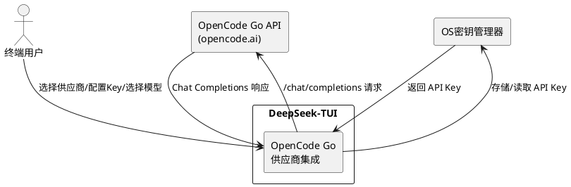
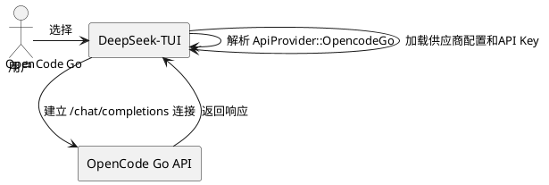
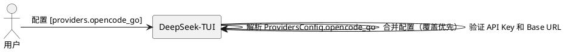
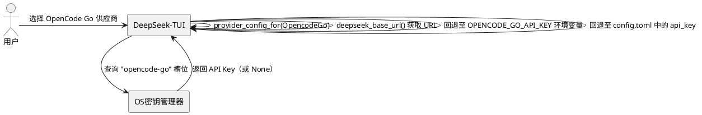
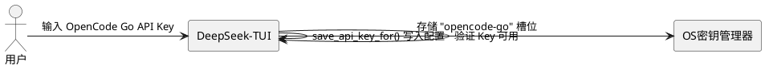
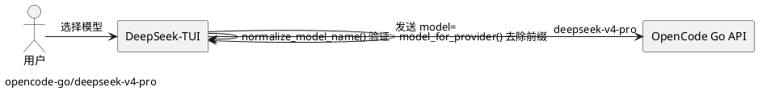
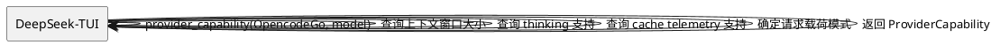
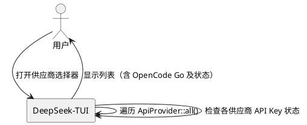

# **1. 组件定位**

## **1.1 核心职责**

本组件负责将OpenCode Go作为新的API供应商集成到DeepSeek-TUI中，使用户能够通过OpenCode Go端点访问14个可用模型进行对话交互。

## **1.2 核心输入**

1. **用户配置输入**：用户在`config.toml`中设置的`providers.opencode_go`配置段（API Key、Base URL、模型选择）
2. **环境变量输入**：`OPENCODE_GO_API_KEY`环境变量提供的API密钥
3. **供应商选择输入**：用户在供应商选择器（Provider Picker）中选择"OpenCode Go"的操作
4. **模型指定输入**：用户通过`opencode-go/`前缀或模型名称指定使用的OpenCode Go模型

## **1.3 核心输出**

1. **API请求输出**：向`https://opencode.ai/zen/go/v1/chat/completions`发送的OpenAI-compatible Chat Completions请求
2. **供应商状态输出**：在供应商选择器中显示"OpenCode Go"选项及其API Key配置状态
3. **模型能力输出**：根据选择的模型返回正确的能力矩阵（上下文窗口、thinking支持、cache telemetry等）
4. **错误提示输出**：当API Key缺失或无效时，返回供应商特定的错误提示信息

## **1.4 职责边界**

1. 本组件**不负责**实现新的API协议——所有OpenCode Go模型统一使用现有OpenAI-compatible Chat Completions协议
2. 本组件**不负责**管理模型的训练或更新——仅使用OpenCode Go已发布的模型列表
3. 本组件**不负责**实现MiniMax M2.7/M2.5的Anthropic `/messages` 端点——所有模型统一走`/chat/completions`
4. 本组件**不负责**修改现有供应商的行为或配置——仅添加新供应商，不影响现有供应商

# **2. 领域术语**

**OpenCode Go**
: 一个提供多种AI模型API访问的供应商平台，通过OpenAI-compatible接口对外提供服务。

**opencode-go**
: OpenCode Go供应商在系统内部的标识符（snake_case格式），用于TOML配置键名、API key存储槽位等。

**opencode-go/**
: OpenCode Go供应商的模型ID前缀，用于在`model_for_provider`重映射中识别需要去除前缀的模型名称。

**Thinking模型**
: 支持推理/思考模式（reasoning mode）的模型，会在最终回答前输出thinking blocks。GLM-5.1、GLM-5、Kimi K2.5、Kimi K2.6、DeepSeek V4 Pro、DeepSeek V4 Flash、MiMo-V2-Pro、MiMo-V2.5-Pro、MiniMax M2.7、MiniMax M2.5、Qwen3.6 Plus、Qwen3.5 Plus属于此类。

**Cache Telemetry模型**
: 支持返回prompt-cache遥测字段的模型。DeepSeek V4 Pro和DeepSeek V4 Flash属于此类。

**1M上下文窗口**
: 模型支持的最大输入token数为1,048,576。DeepSeek V4 Pro、DeepSeek V4 Flash、MiMo-V2-Pro、MiMo-V2-Omni、MiMo-V2.5-Pro、MiMo-V2.5、Qwen3.6 Plus、Qwen3.5 Plus属于此类。

**256K上下文窗口**
: 模型支持的最大输入token数为262,144。Kimi K2.5、Kimi K2.6属于此类。

**200K上下文窗口**
: 模型支持的最大输入token数为204,800。GLM-5.1、GLM-5、MiniMax M2.7属于此类。

**192K上下文窗口**
: 模型支持的最大输入token数为196,608。MiniMax M2.5属于此类。

# **3. 角色与边界**

## **3.1 核心角色**

- **终端用户**：通过TUI界面选择OpenCode Go供应商、配置API Key、选择模型并进行对话交互
- **系统管理员**：通过环境变量或配置文件为用户预配置OpenCode Go的API Key和Base URL

## **3.2 外部系统**

- **OpenCode Go API**：提供OpenAI-compatible Chat Completions端点（`https://opencode.ai/zen/go/v1/chat/completions`），是本组件的上游依赖
- **OS密钥管理器**：用于安全存储OpenCode Go API Key（macOS Keychain、Windows Credential Manager、Linux Secret Service）

## **3.3 交互上下文**

# **4. DFX约束**

## **4.1 性能**

1. OpenCode Go供应商的API请求延迟**不得**因供应商集成代码而额外增加超过10ms的本地处理时间
2. 供应商选择器中显示OpenCode Go选项**不得**导致选择器渲染延迟超过50ms

## **4.2 可靠性**

1. OpenCode Go供应商的API Key解析**必须**遵循与现有供应商相同的优先级：keyring → 环境变量 → 配置文件
2. 当OpenCode Go API不可达时，系统**必须**返回与现有供应商相同格式的错误信息，不得crash

## **4.3 安全性**

1. OpenCode Go API Key**必须**通过OS密钥管理器存储，**禁止**以明文形式长期保存在配置文件中
2. API Key在日志和UI显示中**必须**被掩码处理，**禁止**完整输出
3. `OPENCODE_GO_API_KEY`环境变量**必须**被纳入密钥清理范围（与`DEEPSEEK_API_KEY`等同等处理）

## **4.4 可维护性**

1. 新增供应商**必须**遵循exhaustive match模式——所有涉及`ApiProvider`的match表达式**必须**包含`OpencodeGo`分支，编译器未覆盖时**必须**产生编译错误
2. 供应商数量测试断言**必须**在新增后立即更新，确保后续开发者能通过测试发现遗漏的match分支

## **4.5 兼容性**

1. 新增OpenCode Go供应商**不得**影响任何现有供应商（DeepSeek、DeepSeek-CN、NVIDIA NIM、OpenRouter、Novita、Fireworks、SGLang、vLLM）的行为和配置
2. **必须**使用稳定版Rust编译，**禁止**引入nightly特性或`#![feature(...)]`
3. 配置文件中未指定OpenCode Go相关配置时，系统**必须**正常工作，不得因缺少`providers.opencode_go`段而报错

# **5. 核心能力**

## **5.1 供应商枚举与标识**

### **5.1.1 业务规则**

1. **枚举变体注册**：系统**必须**在`ApiProvider`枚举中添加`OpencodeGo`变体，采用snake_case序列化为`opencode_go`

   a. 验收条件：When 用户在配置中设置`api_provider = "opencode-go"`，the 系统shall 将其解析为`ApiProvider::OpencodeGo`

2. **标识符解析**：`ApiProvider::parse()`**必须**支持将字符串`"opencode-go"`和`"opencode_go"`解析为`OpencodeGo`变体

   a. 验收条件：When 输入字符串为"opencode-go"或"opencode_go"，the `parse()`函数shall 返回`Some(ApiProvider::OpencodeGo)`

3. **标识符输出**：`ApiProvider::as_str()`**必须**为`OpencodeGo`返回`"opencode-go"`

   a. 验收条件：When 调用`ApiProvider::OpencodeGo.as_str()`，the 函数shall 返回`"opencode-go"`

4. **显示名称**：`ApiProvider::display_name()`**必须**为`OpencodeGo`返回`"OpenCode Go"`

   a. 验收条件：When 调用`ApiProvider::OpencodeGo.display_name()`，the 函数shall 返回`"OpenCode Go"`

5. **供应商列表**：`ApiProvider::all()`**必须**包含`OpencodeGo`变体，使其出现在供应商选择器中

   a. 验收条件：When 用户打开供应商选择器，the 系统shall 在列表中显示"OpenCode Go"选项

### **5.1.2 交互流程**

### **5.1.3 异常场景**

1. **无效供应商名称**

   a. 触发条件：用户输入非"opencode-go"或"opencode_go"的字符串
   b. 系统行为：`parse()`返回`None`
   c. 用户感知：配置解析错误提示，提示有效的供应商名称列表

## **5.2 供应商常量与配置**

### **5.2.1 业务规则**

1. **默认模型**：系统**必须**定义常量`DEFAULT_OPENCODE_GO_MODEL`，值为`"deepseek-v4-pro"`

   a. 验收条件：When 用户选择OpenCode Go供应商且未指定模型，the 系统shall 使用"deepseek-v4-pro"作为默认模型

2. **默认Base URL**：系统**必须**定义常量`DEFAULT_OPENCODE_GO_BASE_URL`，值为`"https://opencode.ai/zen/go/v1"`

   a. 验收条件：When 用户选择OpenCode Go供应商且未配置自定义base_url，the 系统shall 使用"https://opencode.ai/zen/go/v1"作为API端点

3. **配置段定义**：`ProvidersConfig`结构体**必须**包含`opencode_go: ProviderConfig`字段

   a. 验收条件：When 用户在config.toml中配置`[providers.opencode_go]`段，the 系统shall 正确解析该段中的api_key、base_url和model字段

4. **配置合并**：`merge_providers_config()`函数**必须**包含`opencode_go`字段的合并逻辑

   a. 验收条件：When 存在基础配置和覆盖配置同时包含opencode_go段，the 合并函数shall 优先使用覆盖配置中的非None字段

### **5.2.2 交互流程**

### **5.2.3 异常场景**

1. **API Key缺失**

   a. 触发条件：用户选择OpenCode Go供应商但未配置API Key（环境变量、keyring、配置文件中均无）
   b. 系统行为：`deepseek_api_key()`返回错误
   c. 用户感知：提示"OpenCode Go API key not found. Set OPENCODE_GO_API_KEY or configure providers.opencode_go.api_key"

2. **Base URL无效**

   a. 触发条件：用户配置了格式错误的base_url
   b. 系统行为：API请求失败，返回连接错误
   c. 用户感知：显示网络连接错误信息

## **5.3 配置解析集成**

### **5.3.1 业务规则**

1. **供应商配置路由**：`provider_config_for()`**必须**为`OpencodeGo`返回`&providers.opencode_go`

   a. 验收条件：When 调用`config.provider_config_for(ApiProvider::OpencodeGo)`，the 函数shall 返回providers.opencode_go字段的引用

2. **默认模型路由**：`default_model()`**必须**为`OpencodeGo`返回`DEFAULT_OPENCODE_GO_MODEL`

   a. 验收条件：When 用户选择OpenCode Go供应商且未配置model，the `default_model()`函数shall 返回"deepseek-v4-pro"

3. **Base URL路由**：`deepseek_base_url()`**必须**为`OpencodeGo`返回配置的base_url或`DEFAULT_OPENCODE_GO_BASE_URL`

   a. 验收条件：When 用户选择OpenCode Go供应商，the `deepseek_base_url()`函数shall 返回配置的base_url或默认值"https://opencode.ai/zen/go/v1"

4. **API Key槽位**：`deepseek_api_key()`**必须**为`OpencodeGo`使用`"opencode-go"`作为密钥存储槽位名

   a. 验收条件：When 用户选择OpenCode Go供应商，the `deepseek_api_key()`函数shall 使用"opencode-go"作为secrets解析的slot名称

5. **环境变量Base URL覆盖**：系统**必须**支持`OPENCODE_GO_BASE_URL`环境变量覆盖默认base URL

   a. 验收条件：When 设置了环境变量OPENCODE_GO_BASE_URL且当前供应商为OpenCode Go，the 系统shall 使用该环境变量的值作为base URL

6. **环境变量模型覆盖**：系统**必须**支持`OPENCODE_GO_MODEL`环境变量覆盖默认模型

   a. 验收条件：When 设置了环境变量OPENCODE_GO_MODEL且当前供应商为OpenCode Go，the 系统shall 使用该环境变量的值作为默认模型

### **5.3.2 交互流程**

### **5.3.3 异常场景**

1. **配置文件中缺少opencode_go段**

   a. 触发条件：config.toml中未定义`[providers.opencode_go]`段
   b. 系统行为：`ProvidersConfig::default()`为opencode_go字段提供空默认值
   c. 用户感知：系统正常运行，使用默认base URL，但需配置API Key后才能使用

## **5.4 API Key管理**

### **5.4.1 业务规则**

1. **环境变量检测**：`has_api_key_for()`**必须**为`OpencodeGo`检查`"OPENCODE_GO_API_KEY"`环境变量

   a. 验收条件：When 设置了环境变量OPENCODE_GO_API_KEY，the `has_api_key_for(config, ApiProvider::OpencodeGo)`shall 返回true

2. **密钥保存**：`save_api_key_for()`**必须**为`OpencodeGo`将API Key写入`"providers.opencode_go"`配置路径

   a. 验收条件：When 调用`save_api_key_for(ApiProvider::OpencodeGo, key)`，the 函数shall 将key保存到config.toml的providers.opencode_go.api_key字段

3. **Secrets环境变量映射**：`secrets::env_for()`**必须**为`"opencode-go"`返回`OPENCODE_GO_API_KEY`候选列表

   a. 验收条件：When 调用`env_for("opencode-go")`，the 函数shall 返回包含"OPENCODE_GO_API_KEY"的环境变量候选列表

4. **供应商选择器环境变量**：`provider_picker::env_var_for()`**必须**为`OpencodeGo`返回`"OPENCODE_GO_API_KEY"`

   a. 验收条件：When 调用`env_var_for(ApiProvider::OpencodeGo)`，the 函数shall 返回"OPENCODE_GO_API_KEY"

5. **供应商命令错误提示**：provider命令**必须**在错误消息中包含`"opencode-go"`供应商名称

   a. 验收条件：When OpenCode Go供应商的API Key无效，the 错误消息shall 包含"opencode-go"文本

### **5.4.2 交互流程**

### **5.4.3 异常场景**

1. **Keyring写入失败**

   a. 触发条件：OS密钥管理器不可用或权限不足
   b. 系统行为：回退至配置文件存储方式
   c. 用户感知：Key保存成功但可能安全性降低，提示已回退至文件存储

## **5.5 模型重映射与规范化**

### **5.5.1 业务规则**

1. **前缀去除**：`model_for_provider()`**必须**为`OpencodeGo`去除`opencode-go/`前缀，将用户友好的模型名转换为API实际接受的模型ID

   a. 验收条件：When 模型名为"opencode-go/deepseek-v4-pro"且供应商为OpencodeGo，the `model_for_provider()`函数shall 返回"deepseek-v4-pro"

2. **无前缀透传**：对于不包含`opencode-go/`前缀的模型名，`model_for_provider()`**必须**原样透传

   a. 验收条件：When 模型名为"deepseek-v4-pro"且供应商为OpencodeGo，the `model_for_provider()`函数shall 返回"deepseek-v4-pro"

3. **14个模型完整支持**：系统**必须**正确处理以下所有14个OpenCode Go模型的名称映射：

   - glm-5.1, glm-5, kimi-k2.5, kimi-k2.6
   - deepseek-v4-pro, deepseek-v4-flash
   - mimo-v2-pro, mimo-v2-omni, mimo-v2.5-pro, mimo-v2.5
   - minimax-m2.7, minimax-m2.5
   - qwen3.6-plus, qwen3.5-plus

   a. 验收条件：When 用户选择上述任一模型（带或不带opencode-go/前缀），the 系统shall 正确将模型名转换为API接受的ID并发送请求

4. **模型规范化扩展**：`normalize_model_name()`**必须**扩展以支持OpenCode Go模型名称的规范化（允许包含`opencode-go/`前缀的模型名通过验证）

   a. 验收条件：When 模型名以"opencode-go/"开头或为已知OpenCode Go模型ID，the `normalize_model_name()`函数shall 返回有效的规范化结果而非None

### **5.5.2 交互流程**

### **5.5.3 异常场景**

1. **未知模型名**

   a. 触发条件：用户输入不属于14个已知模型的名称且不带opencode-go/前缀
   b. 系统行为：模型名透传至API，由API端返回错误
   c. 用户感知：API返回模型不存在的错误信息

## **5.6 能力矩阵**

### **5.6.1 业务规则**

1. **1M上下文窗口模型**：`provider_capability()`**必须**为以下模型设置上下文窗口为1,048,576 tokens：deepseek-v4-pro、deepseek-v4-flash、mimo-v2-pro、mimo-v2-omni、mimo-v2.5-pro、mimo-v2.5、qwen3.6-plus、qwen3.5-plus

   a. 验收条件：When 调用`provider_capability(OpencodeGo, "deepseek-v4-pro")`，the 返回值的context_window字段shall 等于1,048,576

   b. 验收条件：When 调用`provider_capability(OpencodeGo, "mimo-v2-pro")`，the 返回值的context_window字段shall 等于1,048,576

   c. 验收条件：When 调用`provider_capability(OpencodeGo, "mimo-v2-omni")`，the 返回值的context_window字段shall 等于1,048,576

   d. 验收条件：When 调用`provider_capability(OpencodeGo, "mimo-v2.5-pro")`，the 返回值的context_window字段shall 等于1,048,576

   e. 验收条件：When 调用`provider_capability(OpencodeGo, "mimo-v2.5")`，the 返回值的context_window字段shall 等于1,048,576

   f. 验收条件：When 调用`provider_capability(OpencodeGo, "qwen3.6-plus")`，the 返回值的context_window字段shall 等于1,048,576

   g. 验收条件：When 调用`provider_capability(OpencodeGo, "qwen3.5-plus")`，the 返回值的context_window字段shall 等于1,048,576

2. **256K上下文窗口模型**：`provider_capability()`**必须**为以下模型设置上下文窗口为262,144 tokens：kimi-k2.5、kimi-k2.6

   a. 验收条件：When 调用`provider_capability(OpencodeGo, "kimi-k2.5")`，the 返回值的context_window字段shall 等于262,144

   b. 验收条件：When 调用`provider_capability(OpencodeGo, "kimi-k2.6")`，the 返回值的context_window字段shall 等于262,144

3. **200K上下文窗口模型**：`provider_capability()`**必须**为以下模型设置上下文窗口为204,800 tokens：glm-5.1、glm-5、minimax-m2.7

   a. 验收条件：When 调用`provider_capability(OpencodeGo, "glm-5.1")`，the 返回值的context_window字段shall 等于204,800

   b. 验收条件：When 调用`provider_capability(OpencodeGo, "glm-5")`，the 返回值的context_window字段shall 等于204,800

   c. 验收条件：When 调用`provider_capability(OpencodeGo, "minimax-m2.7")`，the 返回值的context_window字段shall 等于204,800

4. **192K上下文窗口模型**：`provider_capability()`**必须**为以下模型设置上下文窗口为196,608 tokens：minimax-m2.5

   a. 验收条件：When 调用`provider_capability(OpencodeGo, "minimax-m2.5")`，the 返回值的context_window字段shall 等于196,608

5. **Thinking支持模型**：`provider_capability()`**必须**为以下模型设置`thinking_supported = true`：glm-5.1、glm-5、kimi-k2.5、kimi-k2.6、deepseek-v4-pro、deepseek-v4-flash、mimo-v2-pro、mimo-v2.5-pro、minimax-m2.7、minimax-m2.5、qwen3.6-plus、qwen3.5-plus

   a. 验收条件：When 调用`provider_capability(OpencodeGo, "glm-5.1")`，the 返回值的thinking_supported字段shall 为true

   b. 验收条件：When 调用`provider_capability(OpencodeGo, "kimi-k2.5")`，the 返回值的thinking_supported字段shall 为true

   c. 验收条件：When 调用`provider_capability(OpencodeGo, "minimax-m2.7")`，the 返回值的thinking_supported字段shall 为true

   d. 验收条件：When 调用`provider_capability(OpencodeGo, "qwen3.6-plus")`，the 返回值的thinking_supported字段shall 为true

6. **非Thinking模型**：`provider_capability()`**必须**为以下模型设置`thinking_supported = false`：mimo-v2-omni、mimo-v2.5

   a. 验收条件：When 调用`provider_capability(OpencodeGo, "mimo-v2-omni")`，the 返回值的thinking_supported字段shall 为false

   b. 验收条件：When 调用`provider_capability(OpencodeGo, "mimo-v2.5")`，the 返回值的thinking_supported字段shall 为false

7. **Cache Telemetry支持模型**：`provider_capability()`**必须**为deepseek-v4-pro和deepseek-v4-flash设置`cache_telemetry_supported = true`

   a. 验收条件：When 调用`provider_capability(OpencodeGo, "deepseek-v4-pro")`，the 返回值的cache_telemetry_supported字段shall 为true

   b. 验收条件：When 调用`provider_capability(OpencodeGo, "deepseek-v4-flash")`，the 返回值的cache_telemetry_supported字段shall 为true

   c. 验收条件：When 调用`provider_capability(OpencodeGo, "glm-5.1")`，the 返回值的cache_telemetry_supported字段shall 为false

8. **请求载荷模式**：`provider_capability()`**必须**为所有OpenCode Go模型设置`request_payload_mode = RequestPayloadMode::ChatCompletions`

   a. 验收条件：When 调用`provider_capability(OpencodeGo, "glm-5.1")`，the 返回值的request_payload_mode字段shall 等于RequestPayloadMode::ChatCompletions

9. **最大输出Token**：`provider_capability()`**必须**按以下模型特定的最大输出Token值设置`max_output`字段：

   - glm-5.1: 131,072（128K）
   - glm-5: 131,072（128K）
   - kimi-k2.5: 65,536（默认值，供应商未公开精确值）
   - kimi-k2.6: 98,304（96K）
   - deepseek-v4-pro: 393,216（384K）
   - deepseek-v4-flash: 393,216（384K）
   - mimo-v2-pro: 131,072（131K）
   - mimo-v2-omni: 65,536（默认值，供应商未公开精确值）
   - mimo-v2.5-pro: 131,072（131K）
   - mimo-v2.5: 65,536（默认值，供应商未公开精确值）
   - minimax-m2.7: 131,072（128K）
   - minimax-m2.5: 32,768（32K）
   - qwen3.6-plus: 65,536（64K）
   - qwen3.5-plus: 65,536（64K）

   a. 验收条件：When 调用`provider_capability(OpencodeGo, "deepseek-v4-pro")`，the 返回值的max_output字段shall 等于393,216

   b. 验收条件：When 调用`provider_capability(OpencodeGo, "glm-5.1")`，the 返回值的max_output字段shall 等于131,072

   c. 验收条件：When 调用`provider_capability(OpencodeGo, "kimi-k2.6")`，the 返回值的max_output字段shall 等于98,304

   d. 验收条件：When 调用`provider_capability(OpencodeGo, "mimo-v2-pro")`，the 返回值的max_output字段shall 等于131,072

   e. 验收条件：When 调用`provider_capability(OpencodeGo, "mimo-v2.5-pro")`，the 返回值的max_output字段shall 等于131,072

   f. 验收条件：When 调用`provider_capability(OpencodeGo, "minimax-m2.7")`，the 返回值的max_output字段shall 等于131,072

   g. 验收条件：When 调用`provider_capability(OpencodeGo, "qwen3.6-plus")`，the 返回值的max_output字段shall 等于65,536

   h. 验收条件：When 调用`provider_capability(OpencodeGo, "minimax-m2.5")`，the 返回值的max_output字段shall 等于32,768

### **5.6.2 交互流程**

### **5.6.3 异常场景**

1. **未知模型的能力查询**

   a. 触发条件：查询不在14个已知模型列表中的模型能力
   b. 系统行为：返回保守的默认能力（128K上下文、thinking不支持、cache telemetry不支持）
   c. 用户感知：系统正常运行，但可能使用次优的配置参数

## **5.7 供应商选择器集成**

### **5.7.1 业务规则**

1. **选择器显示**：供应商选择器**必须**在可选供应商列表中显示"OpenCode Go"选项

   a. 验收条件：When 用户打开供应商选择器，the 列表shall 包含显示名为"OpenCode Go"的选项

2. **环境变量提示**：供应商选择器**必须**为"OpenCode Go"选项显示环境变量`OPENCODE_GO_API_KEY`

   a. 验收条件：When 用户在供应商选择器中高亮"OpenCode Go"选项，the 界面shall 显示环境变量名OPENCODE_GO_API_KEY

3. **API Key状态指示**：供应商选择器**必须**正确反映OpenCode Go的API Key配置状态（已配置/未配置）

   a. 验收条件：When OPENCODE_GO_API_KEY已设置，the 供应商选择器shall 显示OpenCode Go为已配置状态

### **5.7.2 交互流程**

### **5.7.3 异常场景**

（无特定异常场景，选择器行为与现有供应商一致）

## **5.8 测试更新**

### **5.8.1 业务规则**

1. **供应商数量断言更新**：所有引用`ApiProvider`变体数量的测试断言**必须**从当前值（8）更新为9

   a. 验收条件：When 运行`cargo test --workspace --all-features`，the 供应商数量相关测试shall 全部通过

2. **新增供应商专用测试**：系统**必须**包含针对OpenCode Go供应商的测试用例，覆盖以下场景：

   - parse()能正确解析"opencode-go"和"opencode_go"
   - as_str()返回"opencode-go"
   - display_name()返回"OpenCode Go"
   - default_model()返回"deepseek-v4-pro"
   - deepseek_base_url()返回"https://opencode.ai/zen/go/v1"
   - has_api_key_for()能检测OPENCODE_GO_API_KEY环境变量
   - save_api_key_for()能写入providers.opencode_go配置路径
   - provider_capability()为14个模型返回正确的能力矩阵
   - model_for_provider()正确处理opencode-go/前缀

   a. 验收条件：When 运行`cargo test --workspace --all-features`，the 所有OpenCode Go相关测试shall 通过

3. **exhaustive match编译验证**：所有涉及`ApiProvider`的match表达式**必须**包含`OpencodeGo`分支，确保编译器能检测到遗漏

   a. 验收条件：When 编译项目，the 编译器shall 不报告non-exhaustive pattern警告或错误

### **5.8.2 交互流程**

### **5.8.3 异常场景**

1. **测试断言未更新**

   a. 触发条件：开发者添加了OpencodeGo枚举变体但忘记更新测试中的供应商数量
   b. 系统行为：测试失败
   c. 用户感知：CI构建失败，提示供应商数量不匹配

# **6. 数据约束**

## **6.1 OpenCode Go供应商配置**

1. **api_key**：字符串类型，OpenCode Go平台颁发的API密钥，遵循与现有供应商相同的存储优先级（keyring → env → config）
2. **base_url**：字符串类型，默认值为"https://opencode.ai/zen/go/v1"，**必须**是合法的HTTPS URL，尾部斜杠将在规范化时去除
3. **model**：字符串类型，默认值为"deepseek-v4-pro"，可使用`opencode-go/`前缀或裸模型ID

## **6.2 OpenCode Go模型标识**

1. **模型ID**：小写字母、数字、连字符、点号组成的字符串，不含空格和特殊字符
2. **前缀格式**：`opencode-go/{model_id}`，其中model_id为裸模型标识符
3. **裸格式**：直接使用model_id，不带供应商前缀

## **6.3 OpenCode Go能力矩阵数据**

| 模型ID | 上下文窗口 | max_output | thinking_supported | cache_telemetry_supported | 数据来源 |
|---|---|---|---|---|---|
| glm-5.1 | 204,800（200K） | 131,072（128K） | true | false | llm-stats.com, glm5.ai, 阿里云百炼 |
| glm-5 | 204,800（200K） | 131,072（128K） | true | false | llm-stats.com, glm-5.org |
| kimi-k2.5 | 262,144（256K） | 65,536 | true | false | 阿里云百炼 |
| kimi-k2.6 | 262,144（256K） | 98,304（96K） | true | false | 阿里云百炼, Moonshot API |
| deepseek-v4-pro | 1,048,576（1M） | 393,216（384K） | true | true | DeepSeek官方, 阿里云百炼 |
| deepseek-v4-flash | 1,048,576（1M） | 393,216（384K） | true | true | DeepSeek官方, 阿里云百炼 |
| mimo-v2-pro | 1,048,576（1M） | 131,072（131K） | true | false | mimo-v2.org, openrouter.ai |
| mimo-v2-omni | 1,048,576（1M） | 65,536 | false | false | 同系列架构推断 |
| mimo-v2.5-pro | 1,048,576（1M） | 131,072（131K） | true | false | mimo.xiaomi.com, modelscope.cn |
| mimo-v2.5 | 1,048,576（1M） | 65,536 | false | false | platform.xiaomimimo.com |
| minimax-m2.7 | 204,800（200K） | 131,072（128K） | true | false | 火山引擎官方, 知乎, CSDN |
| minimax-m2.5 | 196,608（192K） | 32,768（32K） | true | false | 百度百科, 阿里云百炼 |
| qwen3.6-plus | 1,048,576（1M） | 65,536（64K） | true | false | 阿里云百炼 |
| qwen3.5-plus | 1,048,576（1M） | 65,536（64K） | true | false | 阿里云百炼 |

## **6.4 环境变量映射**

| 环境变量 | 用途 | 优先级 |
|---|---|---|
| OPENCODE_GO_API_KEY | API密钥 | keyring > 此环境变量 > config.toml |
| OPENCODE_GO_BASE_URL | API端点基础URL | 此环境变量 > config.toml > 默认值 |
| OPENCODE_GO_MODEL | 默认模型 | 此环境变量 > config.toml > 默认值 |
